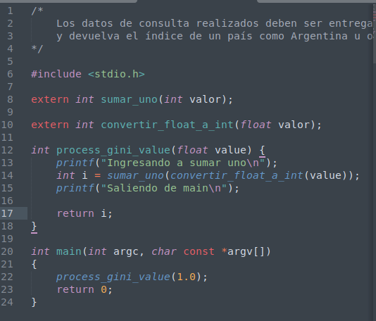
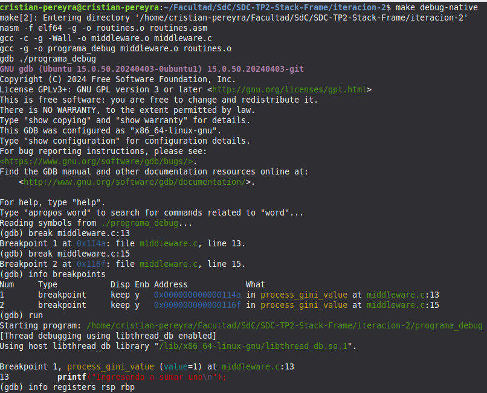
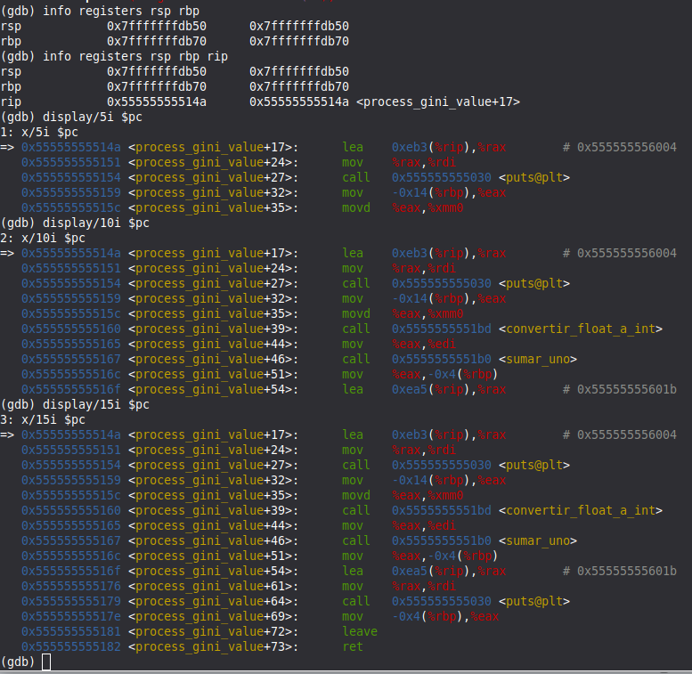
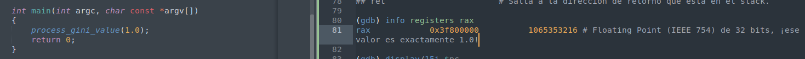
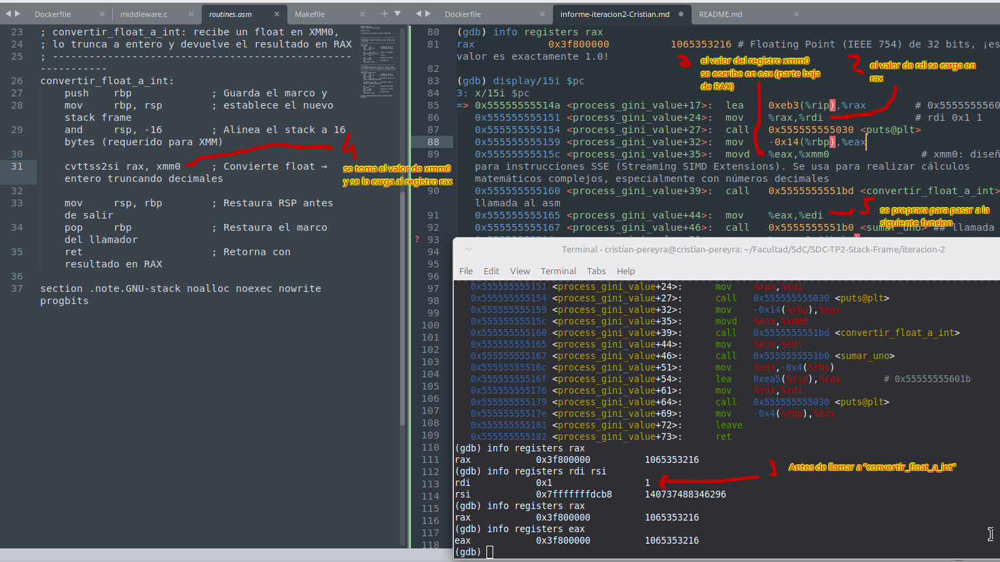

# GDB

## Codigo C



## Configuramos gdb



```bash
# Puntos donde el programa se detendrá
(gdb) break middleware.c:13
Breakpoint 1 at 0x114a: file middleware.c, line 13.
(gdb) break middleware.c:15
Breakpoint 2 at 0x116f: file middleware.c, line 15.
(gdb) info breakpoints
Num     Type           Disp Enb Address            What
1       breakpoint     keep y   0x000000000000114a in process_gini_value at middleware.c:13
2       breakpoint     keep y   0x000000000000116f in process_gini_value at middleware.c:15
(gdb) 

# Ejecutar el programa y detección en el primer breakpoint
(gdb) run
Starting program: /home/cristian-pereyra/Facultad/SdC/SDC-TP2-Stack-Frame/iteracion-2/programa_debug 
[Thread debugging using libthread_db enabled]
Using host libthread_db library "/lib/x86_64-linux-gnu/libthread_db.so.1".

Breakpoint 1, process_gini_value (value=1) at middleware.c:13
13	    printf("Ingresando a sumar uno\n");

```

## Ver el Stack ANTES de la función



```bash
# revisamos los punteros del stack ($rsp y $rbp)
## rsp (stack pointer): Apunta al último dato válido ingresado.
## rbp (base pointer): Se usa para acceder a variables locales (ej. [rbp-4]) y parámetros.
## rbp (...db70) es mayor que rsp (...db60). Esto confirma que el stack crece hacia abajo (hacia direcciones menores).

(gdb) info registers rsp rbp
rsp            0x7fffffffdb50      0x7fffffffdb50
rbp            0x7fffffffdb70      0x7fffffffdb70
(gdb) 

# -------------- Ver los últimos 10 valores (64 bits) en el stack --------------
## eXaminar / 10 valores / de tipo Gigaword (64 bits) / en formato Hexadecimal.
## 0x7fffffffdb60:: Es la dirección de memoria de la celda
## 0x0000000000000000: El valor almacenado en rsp. Probablemente una variable local inicializada en cero.
## 0x00007fffffffdb90: Este valor está en la dirección 0x7fffffffdb70 (donde apunta tu rbp). ¡Es el Saved RBP! Es la dirección del RBP de la función anterior (el "padre").
## 0x0000555555555190: El valor justo después del RBP suele ser la Dirección de Retorno. Es a donde saltará el programa cuando la función actual termine

(gdb) x/10gx $rsp
0x7fffffffdb60:	0x0000000000000000	0x3f80000000000000 # stack pointer
0x7fffffffdb70:	0x00007fffffffdb90	0x0000555555555190 # dirección del RBP de la función anterior | la Dirección de Retorno
0x7fffffffdb80:	0x00007fffffffdcb8	0x00000001ffffdcb8
0x7fffffffdb90:	0x00007fffffffdc30	0x00007ffff7c2a1ca
0x7fffffffdba0:	0x00007fffffffdbe0	0x00007fffffffdcb8

# -------------- Ver las instrucciones para saber dónde estás --------------
## El comando display/15i $pc te muestra las próximas 15 instrucciones que el procesador va a ejecutar.
## $pc (Program Counter) o $rip: Apunta a la instrucción actual.
## =>: Esta flecha indica la instrucción que está a punto de ejecutarse (aún no se ha procesado).
## <process_gini_value+17>: Te indica que estás dentro de la función process_gini_value, exactamente 17 bytes después del inicio. En otras palabras "Estamos dentro de la función process_gini_value, 17 bytes después de que empezó"."
## 0x55555555514a: Es la dirección de memoria física donde reside esa instrucción de código.

# ------- { Instrucciones: El primer puts (Imprimir un string) } -------
## lea    0xeb3(%rip),%rax   # Carga la dirección de un texto (string) en rax
## mov    %rax,%rdi          # Pasa esa dirección al registro RDI (primer argumento en Linux)
## call   0x555555555030     # Llama a puts (imprime el texto en consola)

# ------- { Instrucciones: Llamada a convertir_float_a_int } -------
## mov    -0x14(%rbp),%eax   # Trae un valor de la memoria (variable local en el stack) a eax
## movd   %eax,%xmm0         # Mueve ese valor al registro xmm0 (usado para números de punto flotante)
## call   0x5555555551bd     # Llama a tu función convertir_float_a_int

# ------- { Instrucciones: Llamada a sumar_uno y guardado del resultado } -------
## mov    %eax,%edi          # El resultado de la función anterior quedó en eax, lo mueve a edi (argumento para la siguiente)
## call   0x5555555551b0     # Llama a la función sumar_uno
## mov    %eax,-0x4(%rbp)    # Guarda el resultado final en el stack (en la variable local -0x4)

# ------- { Instrucciones: Epílogo de la función (El cierre) } -------
## mov    -0x4(%rbp),%eax    # Carga el valor de retorno final en eax (por convención, el resultado de una función siempre va en rax/eax)
## leave                     # ¡CRÍTICO! Equivale a: mov rsp, rbp + pop rbp. Restaura el stack del padre.
## ret                       # Salta a la dirección de retorno que está en el stack.

(gdb) info registers rax
rax            0x3f800000          1065353216 # Floating Point (IEEE 754) de 32 bits, ¡ese valor es exactamente 1.0!

(gdb) display/15i $pc
3: x/15i $pc
=> 0x55555555514a <process_gini_value+17>:	lea    0xeb3(%rip),%rax        # 0x555555556004
   0x555555555151 <process_gini_value+24>:	mov    %rax,%rdi 			   # rdi 0x1 1
   0x555555555154 <process_gini_value+27>:	call   0x555555555030 <puts@plt>
   0x555555555159 <process_gini_value+32>:	mov    -0x14(%rbp),%eax
   0x55555555515c <process_gini_value+35>:	movd   %eax,%xmm0				# xmm0: diseñado para instrucciones SSE (Streaming SIMD Extensions). Se usa para realizar cálculos matemáticos complejos, especialmente con números decimales
   0x555555555160 <process_gini_value+39>:	call   0x5555555551bd <convertir_float_a_int> # llamada al asm
   0x555555555165 <process_gini_value+44>:	mov    %eax,%edi
   0x555555555167 <process_gini_value+46>:	call   0x5555555551b0 <sumar_uno> ## llamada a asm
   0x55555555516c <process_gini_value+51>:	mov    %eax,-0x4(%rbp)
   0x55555555516f <process_gini_value+54>:	lea    0xea5(%rip),%rax        # 0x55555555601b
   0x555555555176 <process_gini_value+61>:	mov    %rax,%rdi
   0x555555555179 <process_gini_value+64>:	call   0x555555555030 <puts@plt>
   0x55555555517e <process_gini_value+69>:	mov    -0x4(%rbp),%eax
   0x555555555181 <process_gini_value+72>:	leave
   0x555555555182 <process_gini_value+73>:	ret
(gdb) 


```

## Pasaje de datos





## Ver el Stack DESPUÉS

```bash

gdb) finish
Run till exit from #0  process_gini_value (value=1) at middleware.c:13
Ingresando a sumar uno

Breakpoint 2, process_gini_value (value=1) at middleware.c:15
15	    printf("Saliendo de main\n");
1: x/5i $pc
=> 0x55555555516f <process_gini_value+54>:	lea    0xea5(%rip),%rax        # 0x55555555601b
   0x555555555176 <process_gini_value+61>:	mov    %rax,%rdi
   0x555555555179 <process_gini_value+64>:	call   0x555555555030 <puts@plt>
   0x55555555517e <process_gini_value+69>:	mov    -0x4(%rbp),%eax
   0x555555555181 <process_gini_value+72>:	leave
2: x/10i $pc
=> 0x55555555516f <process_gini_value+54>:	lea    0xea5(%rip),%rax        # 0x55555555601b
   0x555555555176 <process_gini_value+61>:	mov    %rax,%rdi
   0x555555555179 <process_gini_value+64>:	call   0x555555555030 <puts@plt>
   0x55555555517e <process_gini_value+69>:	mov    -0x4(%rbp),%eax
   0x555555555181 <process_gini_value+72>:	leave
   0x555555555182 <process_gini_value+73>:	ret
   0x555555555183 <main>:	endbr64
   0x555555555187 <main+4>:	push   %rbp
   0x555555555188 <main+5>:	mov    %rsp,%rbp
   0x55555555518b <main+8>:	sub    $0x10,%rsp
3: x/15i $pc
=> 0x55555555516f <process_gini_value+54>:	lea    0xea5(%rip),%rax        # 0x55555555601b
   0x555555555176 <process_gini_value+61>:	mov    %rax,%rdi
   0x555555555179 <process_gini_value+64>:	call   0x555555555030 <puts@plt>
   0x55555555517e <process_gini_value+69>:	mov    -0x4(%rbp),%eax
   0x555555555181 <process_gini_value+72>:	leave
   0x555555555182 <process_gini_value+73>:	ret
   0x555555555183 <main>:	endbr64
   0x555555555187 <main+4>:	push   %rbp
   0x555555555188 <main+5>:	mov    %rsp,%rbp
   0x55555555518b <main+8>:	sub    $0x10,%rsp
   0x55555555518f <main+12>:	mov    %edi,-0x4(%rbp)
   0x555555555192 <main+15>:	mov    %rsi,-0x10(%rbp)
   0x555555555196 <main+19>:	mov    0xe90(%rip),%eax        # 0x55555555602c
   0x55555555519c <main+25>:	movd   %eax,%xmm0
   0x5555555551a0 <main+29>:	call   0x555555555139 <process_gini_value>
(gdb) 


```


