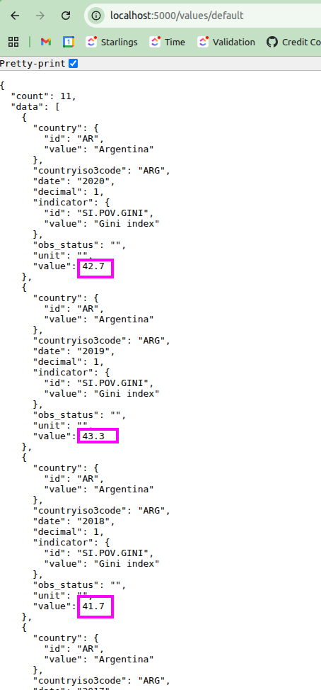
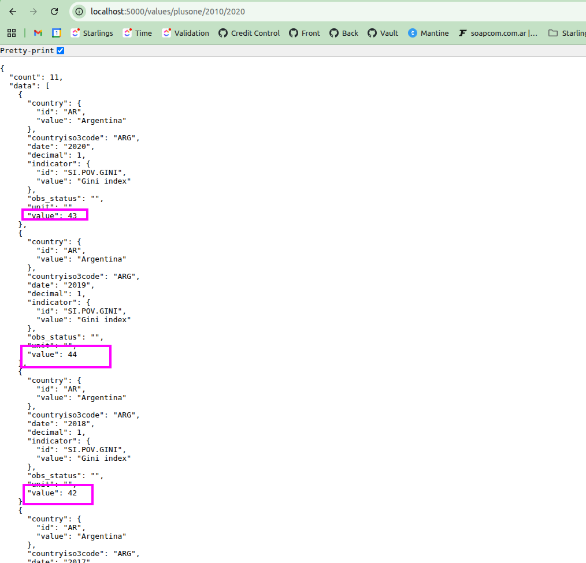
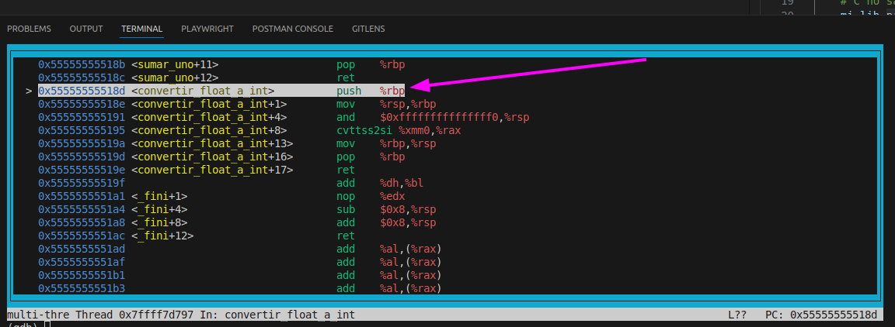
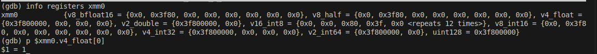
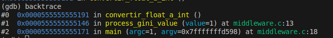
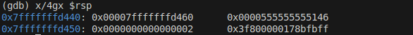
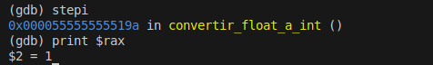

# Informe Trabajo Practico 2

Se explica lo trabajado en la iteración incremental 2 ya que este incluye lo implentado en la iteración 1. Se adjunta el uso de la herramienta gdb para depurar la partes hechas con C y Assembler.

## Desarrollo

En esta interación se incluye la implementación de rutinas en assembler, estas rutinas se encuentran en `iteracion-2/routines.asm`, se implementan: - sumar_uno: Recibe un entero y devuelve el mismo entero incrementado en 1. - convertir_float_a_int: Recibe como primer parámetro un dato de punto flotante como primer parametro mediante el registro especial `xmm0` utilizado para parametros de este tipo. El mismo es truncado utilizando `cvttss2si` y el resultado es retornado mediante `rax`.
A su vez el archivo de rutinas incluye a su final la siguiente directiva `section .note.GNU-stack noalloc noexec nowrite progbits`, que le indica al sistema operativo los permisos necesarios sobre el stack, son metadatos por eso el tipo de sección `.note.GNU-stack`.

Estas rutinas son llamadas por el programa en c, `iteracion-2/middleware.c` el cual la declara como funciones externas mediante el uso de `extern ...`. Este programa recibe un `float` y retorna la parte entera del mismo sumada en 1 utilizando la rutinas de assembler.

El programa en `c` es utilizado por `iteracion-1/back/middleware.py` que es un archivo de python que carga la librería dinámica `libreria.so`, generada a partir del `middleware.c`. Luego ejecuta la función `process_gini_value` implementada en la libreria y retorna el resultado. Donde la carga y ejecución de esta función se hace medidante: - `ctypes.CDLL(...)`: Carga la libreria hecha en `c`, donde: - `ctypes`, que es una libreria de python para llamar funciones dentro de archivos compilados en C, y `CDLL` indica que la biblioteca usa la convención de llamadas de C. - Luego `.argtypes` y `.restype` definen cuales son los parametros, tipos de la entrada y la salida respectivamente. - Finalmente se llama la funcion en `c` pasandole el argumento `f`, que es el valor de punto flotante asociado al indice de GINI.

Esta funcion `middleware` en python es llamada por la API rest en la ruta `/values/plusone/<date_start>/<date_end>` declarada en `iteracion-2/interface.py`. Dentro de un bucle `for` que procesa todos los indices de GINI antes de enviar la respuesta al cliente.

Para poder levantar y ejecutar el proyecto se debe ejecutar los siguentes comandos (una vez en el directorio raiz):

```bash
   # instala docker para poder levantar el contenedor luego solo ejecutar si no se tiene docker
   ./docker
   # Ejecutamos el build que compila el .c y el .asm generando el .so
   make build
   # Levantamos el contenedor junto con la api REST
   make start
```

## Resultados

Mostramos los valores originales y leugo los valores modificados, con los requisitos del trabajo.
**Valores originales** obtenidos mediante la ruta `/values/default`, que por defecto toma los valores desde el 2010 al 2020:



**Valores modificados** obtenidos mediante la ruta `/values/plusone/2010/2020`



## Depuración con GDB

Para facilitar la depuración se agrego un caso al makefile `iteracion-2/Makefile` llamado `debug-native`. Donde se utiliza:

- `nasm -f elf64 -g ...` y `gcc -c -g ...`: Compila el assembler y el codigo de c con el flag -g para incluir la información de depuración.
- `gcc -g -o programa_debug middleware.o routines.o`: Crea un binario para depuración con el flag -g llamado `programa_debug`.
- `gdb ./programa_debug`: Inicia el debug con GNU Debugger.

Agregamos un breakp point en la función `process_gini_value` y ejecutamos.

```bash
(gdb) break process_gini_value

Breakpoint 1 at 0x113a: file middleware.c, line 13.

(gdb) run

Starting program: /home/francisco/Desktop/Facultad/SistemasDeComputacion/SDC-TP2-Stack-Frame/iteracion-2/programa_debug
[Thread debugging using libthread_db enabled]
Using host libthread_db library "/lib/x86_64-linux-gnu/libthread_db.so.1".

Breakpoint 1, process_gini_value (value=1) at middleware.c:13
13          return sumar_uno(convertir_float_a_int(value));
```

Ahora hacemos `stepi` 3 veces para enntrar al la funcion `convertir_float_a_int` en assembler:

```bash
(gdb) stepi
0x000055555555513d      13          return sumar_uno(convertir_float_a_int(value));
(gdb) stepi
0x0000555555555141      13          return sumar_uno(convertir_float_a_int(value));
(gdb) stepi
0x000055555555518d in convertir_float_a_int ()
```

Luego con `layout asm` podemos ver el assembler de `convertir_float_a_int`:



Podemos ver el valor que llego de `c` como parametro con `info registers xmm0`. Luego con el comando `p $xmm0.v4_float[0]` podemos ver que en efecto el valor es el 1.0 que pasamos en el `main` del `iteracion-2/middleware.c`.



Podemos ver la cadena de llamadas con `backtrace`:



Avanzamos con `stepi` hasta `cvttss2si` una vez que se guardo el base pointer anterior. Podemos ver el stack con `x/4gx $rsp`:



Ejecutamos la conversion con `cvttss2si` y printeamos el resultado que esta cargado en `$rax`:


