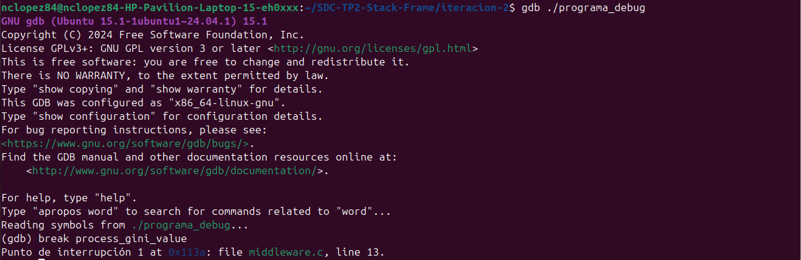
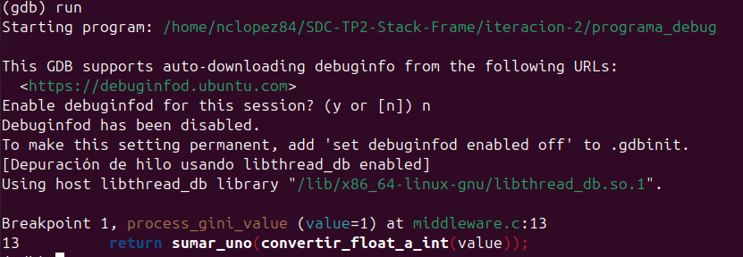
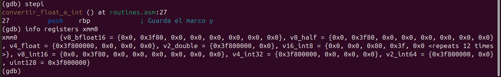
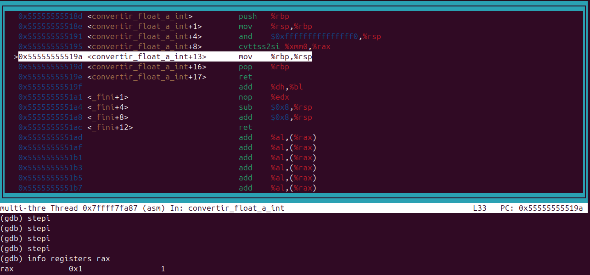

# GDB — Depuración de rutinas ASM

Se depura la función `process_gini_value` definida en `middleware.c`, que internamente llama a las rutinas en ensamblador `convertir_float_a_int` y `sumar_uno` implementadas en `routines.asm`.

El objetivo es mostrar el estado del stack **antes, durante y después** de la ejecución de las rutinas ASM, siguiendo la convención de llamadas System V AMD64 ABI.

---

## Compilación del ejecutable de debug

Para poder depurar con GDB es necesario compilar incluyendo símbolos de debug con el flag `-g` y sin optimizaciones con `-O0`:

```bash
nasm -f elf64 -g -o routines.o routines.asm
gcc -g -O0 -o programa_debug middleware.c routines.o
```

---

## Configuración de GDB y breakpoint

Se inicia GDB con el ejecutable de debug y se establece un breakpoint al inicio de `process_gini_value` para detener la ejecución justo antes de que se llamen las rutinas ASM:

```bash
gdb ./programa_debug
(gdb) break process_gini_value
```



El breakpoint queda registrado en `middleware.c` línea 13, que es donde comienza la función.

---

## Ejecución hasta el breakpoint

```bash
(gdb) run
```



El programa se detiene en el breakpoint con `value=1`, confirmando que la función recibió el valor `1.0` desde `main`.

---

## ANTES — Estado del stack al entrar a la función

Se examina el stack y los registros antes de que se ejecuten las rutinas ASM:

```bash
(gdb) x/10gx $rsp
(gdb) info registers rsp rbp
```


Observaciones:

- `rsp = 0x7fffffffdc50` apunta a la cima actual del stack.
- `rbp = 0x7fffffffdc60` es el puntero base del frame actual de `process_gini_value`.
- `rbp` es mayor que `rsp`, lo que confirma que el stack crece hacia direcciones menores.
- El valor `0x3f80000000000000` visible en el stack es la representación IEEE 754 de `1.0` en punto flotante, que es el parámetro que se va a procesar.

---

## DURANTE — Entrada a la rutina ASM

Se avanza con `stepi` hasta entrar a `convertir_float_a_int`:

```bash
(gdb) stepi
```



Una vez dentro de la rutina ASM se verifica el parámetro recibido:

```bash
(gdb) info registers xmm0
```

El registro `xmm0` muestra `v4_float = {0x3f800000}`, que es la representación IEEE 754 de `1.0`. Esto confirma que el parámetro llegó correctamente desde C al ensamblador a través del registro `%xmm0`, tal como establece la convención System V AMD64 ABI para argumentos de tipo `float`.

---

## DURANTE — Visualización del código ASM con layout

```bash
(gdb) layout asm
```


Se observa la función completa en ensamblador:

| Instrucción | Descripción |
|---|---|
| `push %rbp` | Prólogo: guarda el frame del llamador |
| `mov %rsp, %rbp` | Establece el nuevo stack frame |
| `and $0xfffffffffffffff0, %rsp` | Alinea el stack a 16 bytes (requerido para registros XMM) |
| `cvttss2si %xmm0, %rax` | Convierte el float a entero truncando los decimales |
| `mov %rbp, %rsp` | Epílogo: restaura el stack pointer |
| `pop %rbp` | Restaura el frame del llamador |
| `ret` | Retorna con el resultado en `%rax` |

---

## DURANTE — Resultado de cvttss2si

Se avanza con `stepi` hasta ejecutar la instrucción `cvttss2si` y se verifica el resultado:

```bash
(gdb) stepi  # push rbp
(gdb) stepi  # mov rsp, rbp
(gdb) stepi  # and rsp, -16
(gdb) stepi  # cvttss2si xmm0, rax
(gdb) info registers rax
```



`rax = 0x1 = 1`. La instrucción `cvttss2si` convirtió correctamente el valor `1.0` en el entero `1`, truncando los decimales. El resultado queda listo en `%rax` para ser retornado a `process_gini_value`.

---

## DESPUÉS — Stack restaurado tras la ejecución

Se ejecuta `finish` para completar la rutina y se examina el estado final del stack:

```bash
(gdb) finish
(gdb) x/10gx $rsp
(gdb) info registers rsp rbp rax
```


Observaciones:

- `rsp = 0x7fffffffdc50` volvió exactamente al mismo valor que tenía antes de la llamada.
- `rbp = 0x7fffffffdc60` también fue restaurado correctamente.
- `rax = 0x1 = 1` contiene el resultado de `convertir_float_a_int(1.0)`.
- El stack quedó en el mismo estado que antes de ejecutar la rutina, lo que confirma que el prólogo y epílogo funcionaron correctamente y no hubo corrupción de memoria.

---

## Conclusión

La sesión de GDB confirma que las rutinas ASM respetan correctamente la convención de llamadas System V AMD64 ABI:

- El parámetro `float` llegó correctamente en `%xmm0`.
- La instrucción `cvttss2si` realizó la conversión de punto flotante a entero.
- El resultado quedó en `%rax` listo para ser retornado.
- El stack fue preservado: `rsp` y `rbp` volvieron a sus valores originales después de la llamada.
