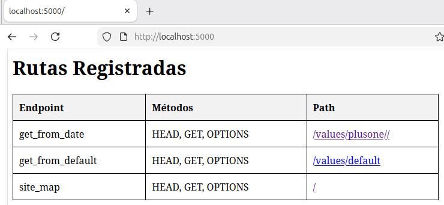
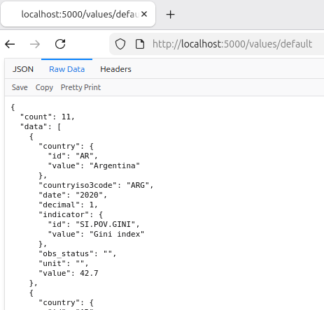
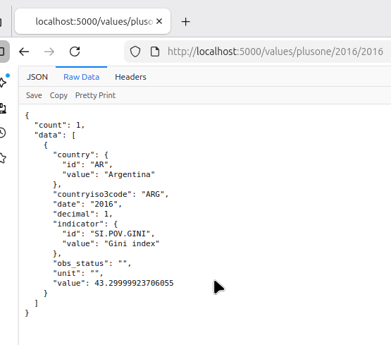
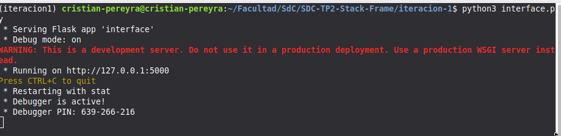

# Iteracion 1

# Interface (python)

## Rutas

Esta interface tiene dos metodos 

- **/values/plusone/<date_start>/<date_end>:** Permite definirmos años que serán obteneido del banco central
- **/values/default:** Permite obtener los valores por defectos del tp. Los años serán 2011:2020 y los valores no serán afectados.



## Formas de trabajo

El banco central nos devuelve indicadores GINI y su valor. Cada valor será incrementado en 1 por una isntancia en C y se reemplazará el valor original para se devuelvo por fast api.

- Valores originales



- Valores actualizados




---

# Anexo

## Instanciar flask

```bash
python3 iteracion-1/interface.py
```



## Compilar C

```bash
gcc -shared -o libreria.so -fPIC middleware.c
```

## Instalación

- **Python**

```bash
# Python
sudo apt -y update 
sudo apt install -y python3 python3-pip

# flask
sudo apt -y update 
sudo apt install -y python3 python3-pip

# Dependencias
python3 -m venv .tp2
source .tp2/bin/activate
pip3 install -r requirement.txt
```
